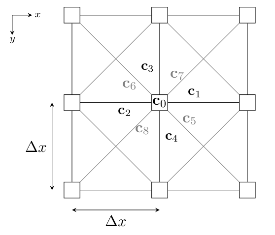

# Bio-LBM
The purpose of this code is the simulation of populations of biological species using the [Lattice Boltzmann Method](https://en.wikipedia.org/wiki/Lattice_Boltzmann_methods) (LBM).
However, the code is still work in progress.

## LBM
The LBM is a computational fluid dynamics method working on the *mesoscopic* scale.
This means that it does neither aim at solving the governing equations of fluid dynamics on a level of its macroscopic properties (e.g., the density, fluid velocity and energy), nor on a microscopic level where individual particles are considered.
Instead, the LBM considers the so-called *particle distribution function* of particles.
This function describes the change in mass density (i.e. amount of particles) in physical space and velocity space (also called *phase space*) with time.
The *moments* of this function can then be used to compute macroscopic properties of the simulated fluid, which comply with the [Navier-Stokes Equations](https://en.wikipedia.org/wiki/Navier%E2%80%93Stokes_equations) (NSE).

However, while the LBM is historically often used for the fluid dynamics in a physical / mechanical engineering setting, it is certainly not restricted to it.
In this code will aim at harnessing this in order to simulate biological ''particles'' (e.g., bacteria) instead of the atoms and molecules typically encountered in fluid simulations.

## Lattice
As the name suggests, the LBM revolves around a discrete lattice.
This lattice consists of discrete nodes populated by particles.
Particles can only reside at such lattice nodes, thus the use of the lattice essentially discretizes the physical space.
In addition to that, the velocity space is also discretized by this lattice, as populations are assumed to only be able to propagate between adjacent lattice nodes, thus resulting in a discrete set of velocities.

There are different types of lattices typically used in the LBM.
However, they cannot be arbitrary for physical reasons.
In the literature on the LBM such lattices are typically specified using the *DnQm* notation, where *n* denotes the amount of dimensions in physical space and *m* the amount of discrete velocities.
Currently, this code supports the popular *D2Q9* and *D2Q5* velocity sets.
This means, that it can simulate 2D scenarios with nine / 5 velocity vectors.
The below image illustrates the D2Q9 lattice, where $x_c$ denotes the velocity vectors (the D2Q5 does not feature the diagonal lattice velocities).

## Basic Algorithm
The basic LBM algorithm consists of alternating *streaming* and *collision* steps per discrete time step.
Note that populations are defined per location, time *and* velocity.
Thus, at each lattice node, there are nine populations per time-step.

### Streaming
In the streaming step populations are propagated along their respective velocity vector, mimicking the movement of particles.
This code implements the streaming step in a periodic fashion, i.e., populations leaving on one side re-enter on the opposing side.
While this is fine for systems with a periodic flow solution, proper boundary constraints are required when this is not the case.
The implemented boundary constraints will be discussed further below.

### Collision
The purpose of the collision step is to model scattering due to collisions between particles while moving.
The simplest possible collision that respects the physical conservation constraints is the so-called *BGK* collision operator, which simply relaxes populations towards their respective equilibrium distribution (a Maxwell-Boltzmann distribution) in a linear fashion.
The relaxation time depends on the fluid's viscosity.
Note that the BGK operator is just an approximation of the proper collision term!

The intuition behind the above is the following: It is known from Maxwell and Boltzmann that particles colliding with each other (for monoatomic, binary, ellastic collisions), that the particles will eventually be distributed according to the Maxwell-Boltzmann distribution (which is the system's equilibrium, hence called equilibrium distribution).
The BGK operator captures this behavior by guaranteeing that the populations will eventually adhere to this equilibrium distribution.
It does this by gradually replacing particles of the original distribution by ones distributed according to the equilibrium.

The implemented collision scheme is for currently the BGK operator, as this is the one almost all other implementations and publications use as well, thus allowing the comparison of results.

It will be replaced in future version by an operator capturing the physics of reacting collisions (as happening for particles of biological species).

### Boundary Constraints
The purpose of the LBM is to approximate solutions for the fundamental fluid dynamics equations.
However, these equations alone do not fully capture the behavior of a fluid system.
For that, they require boundary constraints (i.e., a specification on how the fluid behave at walls, inlets, outlets etc.), as well as an initialization.
Naturally, these boundary constraints also need to be incorporated into the LBM.

As reported by Krueger *et al.* in [[1]](#1), there are essentially two flavors of boundary constraints.
One is the so-called *wet-node* approach, where the boundaries lie on actual lattice nodes.
This is the type implemented by this code.
The other approach is the so-called *link-wise* one, where boundaries lie between lattice nodes.
While the difference in these two approaches is purely conceptual, it leads to different implementations.

This code comes with an implementation of the *non-equilibrium bounce-back* method that considers not only the equilibrium distributions at walls, but also the non-equilibrium populations.
However, the code also supports periodic boundary conditions / streaming

## Tests
In order to assert the validity and accuracy of the implementation, this code comes with some fluid dynamics benchmarks (in the [test](.test) directory).

## References
<a id="1">[1]</a> 
Krueger T., Kusumaatmaja H., Kuzmin A., Shardt O., Silva G. and Viggen E. M.
The Lattice Boltzmann Method: Principles and Practice
Graduate Texts in Physics, Springer
